<div align="center">



# MCP-MyPC

**Ask your AI to fix your computer, or your mom's, from anywhere.**

MCP-MyPC lets Claude, Codex or ChatGPT actually use your computer when you ask: find out why it's slow, track down a lost file, read an error off the screen. Pair the family's computers once with a private code and your AI can help on theirs too, wherever they are, with **nothing to set up on your router**. You install it by **pasting one short message into your AI**.

[](https://github.com/LunarWerxs/MCP-MyPC/actions/workflows/ci.yml)
[](LICENSE)
[](https://nodejs.org)

[](https://modelcontextprotocol.io)

[](https://discord.gg/PsWpeNUzhk)

[**🚀 Install**](#-install-tell-your-ai) · [🔒 Is it safe?](#-is-it-safe) · [🧰 What it can do](#-what-your-ai-can-do) · [❓ FAQ](#-faq) · [🧩 How it works](#-how-it-works)

<br/>


<br/>
<sub><i>What your AI runs for you, replayed from real <code>mypc</code> output. The family code in it is a made-up example.</i></sub>

</div>

MCP-MyPC is a free, open-source MCP server for Windows, macOS and Linux. (MCP is the standard way AI apps plug into other programs.) It lets an AI assistant use the computer it is installed on and, after a one-time pairing with a family code, the other computers in the family, wherever they are. There is no VPN, Tailscale, port forwarding or router setting involved, and the one thing to install first is Node.js 22 or newer (the browser tool also needs Chrome, Edge or Brave).

---

## TL;DR

- 🗣️ **Install by asking.** Paste one short message into the Code tab in the Claude app, Claude Code or Codex, and it sets itself up. No administrator rights for MCP-MyPC itself, nothing to build.
- 🖐️ **Your AI looks instead of guessing.** It can run commands, read and save files, **see the screen**, and use a browser window you can watch.
- 👪 **Help the family from anywhere.** Pair computers once with a private code, and *"what's on Mom's screen?"* works whenever her computer is on and she is signed in.
- 🔒 **The family code is a key to every family computer.** Anyone who has it can use them all, so share it only privately. Family messages are end-to-end encrypted with it, and the relay in the middle, a small server that passes messages along, **cannot read, change or fake them**. The optional ChatGPT link is the exception: it works like a password too, and it is **not** end-to-end encrypted ([details](#chatgpt)).
- 🛑 **You can see it and stop it.** What another computer does on yours is **logged on yours**. `mypc uninstall` cuts off every path at once; `mypc family leave` and `mypc chatgpt off` each cut one. None of them undoes what was already done.
- 🆓 **Free and open source (MIT)**, for the Claude desktop app, Claude Code, Codex and ChatGPT (Plus or Pro).

---

## 🌱 The story

MCP-MyPC was built for one family. The author wanted his mom and his brother to be able to tell their AI "install this", and then have it help on their own computers and on each other's, without anyone learning what a VPN or a port forward is. So it is made for families, and **the author stays out of it**: he never holds a family's code, and the family's own messages stay sealed as they pass through the shared relay his studio runs. The one exception is the optional ChatGPT link, which that relay carries unsealed ([Is it safe?](#-is-it-safe)).

---

## 💬 Things you can ask

Once it's set up, talk to your AI the way you would talk to the family member who usually fixes the computer:

| | |
| :-- | :-- |
| 🐢 **A slow computer** | *"My computer has been really slow all week. Can you figure out why?"* |
| 📄 **A lost file** | *"Find the PDF I downloaded yesterday and open it for me."* |
| 💾 **Disk space** | *"How much space is left on my hard drive?"* |
| 👀 **An error on Mom's screen** | *"Take a screenshot of Mom's PC and tell me what that error message says."* |
| 🌐 **A website for Dad** | *"Open the library website on Dad's computer so he can see it."* |
| 🧾 **What happened here** | *"What have the other family computers done on this one today?"* |

Short names are enough: "mom" finds "Mom's PC".

---

## 🚀 Install: tell your AI

You don't install MCP-MyPC by hand. Your AI does it.

**1. Open an AI that can run commands on your computer:** the **Code** tab in the Claude desktop app, **Claude Code**, or **Codex**. (An ordinary chat can't install programs. These three can.) If you only use ChatGPT, do the install with one of these first, then [turn on the ChatGPT link](#chatgpt).

**2. Paste this**, with your own name for the computer in place of "Mom's PC":

```text
Install MCP-MyPC from https://github.com/LunarWerxs/MCP-MyPC on this computer. Follow the "For the AI doing the install" steps in its README. Call this computer "Mom's PC".
```

Did a family member already send you a code? Add this line to the end, with their code in place of the angle brackets:

```text
Then join my MCP-MyPC family with code <the code they sent you>.
```

**3. Do what it tells you.** Your AI checks for Node.js (and helps you install it if it's missing), downloads MCP-MyPC and sets it up. Usually the one thing left for you is to quit the Claude app completely and open it again: see [Turn it on](#-turn-it-on).

---

## 🔌 Turn it on

| App | What to do |
| --- | --- |
| **Claude desktop app** | Quit it completely (Windows: right-click the Claude icon next to the clock > **Quit**; Mac: **Claude** menu > **Quit Claude**). Closing the window is not enough. Open it again and ask: *"Take a screenshot of my computer"*. Claude asks before it uses MCP-MyPC; allow it. |
| **Claude Code** | Start a new chat. It's already there. |
| **Codex** | Start a new session. The install adds MCP-MyPC to Codex's settings when Codex is on the computer. |
| **ChatGPT** | Turn on the private link below. Needs a Plus or Pro plan. |

### ChatGPT

ChatGPT can only reach tools at a public web address, so MCP-MyPC gives this computer a private link on the relay, shaped like `https://mcp-mypc-relay.lunawerx.workers.dev/link/<43 private characters>/mcp`. Ask your AI to *"turn on the MCP-MyPC ChatGPT link"* (it runs `mypc chatgpt on`). It prints your link and these three steps, for ChatGPT on the web:

1. Open **Settings** and turn on **Developer mode** (under **Apps & Connectors > Advanced**, or under **Security** in newer versions).
2. Add a new app or connector with the **Create** or **+** button. Name it **MyPC**, paste your link, choose **No authentication**, confirm you trust it, and save.
3. In a new chat, turn on **MyPC** from the **+** menu and ask: *"Take a screenshot of my computer"*.

> [!WARNING]
> **The link works like a password, and it is the one path that is not end-to-end encrypted.** Anyone who has it can use this computer and, through it, the family's. ChatGPT talks to the relay over ordinary HTTPS, which ends at the relay, so whoever runs the relay (and Cloudflare, whose servers it runs on) could in principle see that traffic and send requests of its own through the link, which means using this computer and, through it, the family's. That includes reading the family code from this computer's settings, which keeps working after the link is off. `mypc chatgpt off` shuts the link within about 5 seconds, for good, and `mypc chatgpt on` afterwards makes a new one. If the link may have got out, change the family code too ([how](#see-it-and-stop-it)). Claude and Codex never use the link. The computer has to be switched on and signed in for ChatGPT to reach it.

---

## 👪 Family computers

Pair once, and your AI can help on any computer in the family.

1. **On the first computer**, ask your AI to *"start an MCP-MyPC family"* (it runs `mypc family create`). You get a long code that starts with `MYPC-`.
2. **Send the code privately** to the family member who should join. A text message is fine.
3. **On their computer**, they tell their AI *"join my MCP-MyPC family with code"* followed by the code (it runs `mypc family join <code>`). No MCP-MyPC there yet? They use the [install prompt](#-install-tell-your-ai) with the extra join line.
4. **Check it worked:** run `mypc status` (or ask your AI to run it). The others show up while they are switched on and signed in. An AI app that was already open when this computer joined sees the family only after it restarts: quit and reopen the Claude desktop app, or start a new Claude Code or Codex session.

That's it: different houses, different Wi-Fi, no network setup. The code is forgiving to type: capital letters or not, dashes or none, and an O works as a zero, an I or L as a one. If you type it with spaces, put it in quotes: `mypc family join "MYPC 7K2Q ..."`.

**Want the code kept out of your AI chats?** When your AI runs the family commands, the code appears in that chat like anything else it reads, so a copy of the key to every family computer goes to that AI company and stays in that chat's history. Run `mypc family create` and `mypc family join <code>` yourself in a terminal instead.

---

## 🔒 Is it safe?

MCP-MyPC gives an AI real hands on a real computer, so here is plainly who can use it, what passes through whose hands, and how to see and stop it.

### Who can use this computer

| Who | How they get in | Only while |
| --- | --- | --- |
| **You, through your own AI app** (the Claude desktop app, Claude Code, Codex) | The app runs MCP-MyPC right here on this computer | You are chatting. The Claude apps ask you before each step unless you turn that off |
| **Anyone who has your family code** | From their own computer, usually by asking their AI | This computer is in the family, switched on and signed in |
| **Anyone who has the ChatGPT link of this computer, or of any family computer** | ChatGPT, or anything else that can send a request to that web address. A family computer's link reaches this one through the family | That link is on. Each stays off until someone runs `mypc chatgpt on` on that computer (anyone with the family code can do that from afar) |

**Nobody else,** unless they get a copy of the code or a link: not the relay, and not the people who make MCP-MyPC (a ChatGPT link that is or was on anywhere in the family is the exception, below). Everyone in the table gets the same tools, with the same rights as the user account MCP-MyPC was installed under (on a computer with several accounts, it answers only while that account is signed in). MCP-MyPC never asks for administrator rights, but if that account can act as administrator without a prompt (for example passwordless sudo), so can they.

### Worth knowing

- 🔑 **Anyone with the family code can use every family computer**, screen included, and the computer being used does not ask its owner before each action. Give the code only to people you would trust at your unlocked computer.
- 🙋 **Your AI is told to ask first.** It explains in plain words and asks before deleting files, uninstalling programs, changing settings or anything else hard to undo. That is an instruction to the AI, not a lock on the computer, so guard the family code like a house key.
- 🔐 **The relay can't read or fake family messages.** The relay passes messages between family computers; the shared one is run by LunarWerx Studios. Every family message is end-to-end encrypted with a key made from your family code, and the code is made on your computer and never sent to the relay. The relay sees only a scrambled room id, how many connections the room has and when (so when each computer is switched on and signed in), which connection sent each message, when it was sent and how big it is, and, like any server, the internet address each computer connects from. A changed, faked or replayed message is thrown away.
- ⚠️ **The ChatGPT link is the exception.** It is off unless you turn it on, on each computer separately, and its traffic is [not end-to-end encrypted](#chatgpt). Whoever runs the relay (and Cloudflare, whose servers run every relay) could in principle see it and use that computer, and the whole family through it. That includes reading the family code, which keeps working after the link is off. A link turned on at any one family computer opens every family computer this way. Claude and Codex never use it. If that matters to you, keep every link in the family off, or [run your own relay](#-run-your-own-relay), which takes LunarWerx Studios, though not Cloudflare, out of that path.
- 📤 **What an AI reads goes to that AI's company** as part of the chat (a screenshot, a file, a command's output), the same as if it had been pasted in. When a family member's AI reads from your computer, it goes to their AI company, in their chat history.

### See it, and stop it

| To | Do this |
| --- | --- |
| See what others did on this computer | Ask your AI to *"show the remote activity"*, or open `~/.mcp-mypc/remote-activity.log`. Each line has the time, who asked (a family computer's name, or "ChatGPT link" for this computer's own link), the tool, and for most tools what it was for: the command, file or web address. A request made through another family computer's ChatGPT link is logged here under that computer's name, not as the ChatGPT link |
| Cut this computer off from the family | `mypc family leave`. The others can no longer reach it within about 5 seconds |
| Lock out someone who has the code | On every family computer, run `mypc family leave` and `mypc chatgpt off` (anyone with the code could have turned a ChatGPT link on there). Then one computer runs `mypc family create`, and each computer that should stay runs `mypc family join <new code>`. This ends their access through the old code. It does not undo anything they already did on those computers. With the code they could run any command there, including changing MCP-MyPC's own files or adding a program that starts at sign-in. If they might have, then on each computer, before creating or joining the new family: run `mypc uninstall --purge`, delete the `MCP-MyPC` folder in the home folder, and install again with the [install prompt](#-install-tell-your-ai) |
| Kill the ChatGPT link | `mypc chatgpt off`. The old link stops working for good; `mypc chatgpt on` later makes a new one. If the link got out, change the family code too (the row above): whoever had it could have read the code from this computer's settings |
| Remove it completely | `mypc uninstall --purge` (details in the [FAQ](#-faq)) |
| Stop it right now, without typing anything | Switch the computer off, or sign out |

The log names each caller by the name its computer gave itself, and anyone holding the code could pick any name: one more reason the code is the thing to guard. They can also run commands here, so they could edit or empty the log, and each line keeps only the first 200 characters of a command. The log is a record of honest use, not proof. What your own AI does on your own computer is not in this log; your chat shows it.

---

## 🧰 What your AI can do

These are the tools MCP-MyPC gives your AI ([src/tools/index.mjs](src/tools/index.mjs) is the list):

| Tool | What it lets your AI do | Opens anything on that screen? |
| --- | --- | --- |
| `list_computers` | See this computer and the family computers online right now, with their systems | No |
| `run_command` | Run a command: PowerShell on Windows, the login shell on macOS and Linux. It stops after 2 minutes unless asked for longer (up to an hour; through the ChatGPT link the answer has to come back within 4 minutes), along with everything it started. It never waits for typing, and very long output is cut off | No, unless the command starts a program |
| `read_file` | Read a text file, or look at a picture (png, jpg, gif, webp) up to 5 MB. Files over 20 MB are refused | No |
| `write_file` | Save text to a file, making folders as needed, or add to the end of one | No |
| `list_folder` | List a folder (the home folder unless told otherwise), folders first, up to 500 entries | No |
| `screenshot` | Take a picture of the screen: every monitor on Windows and Linux, the main display on a Mac (on Windows and macOS, shrunk to at most 1600 pixels wide) | No |
| `browser` | Work its own separate browser window (Chrome, Edge or Brave; Chromium too on a Mac or Linux), which starts signed out of everything and never uses your own browser profile: open a page, read it, click, type, go back, take a picture of it, close it. Anything signed in there stays signed in, for family members and the ChatGPT link too, so don't sign in to your own accounts in it | **Yes**, its own window |
| `computer_info` | Check the system version, processor, memory, disks, how long it has been on, and the home folder | No |
| `open` | Open a website, file or folder with its usual program, for the person at that computer | **Yes** |
| `remote_activity` | Show what family computers and the ChatGPT link did on this computer | No |

Every tool except `list_computers` also takes a `computer`: a family computer's name, or part of it. Leave it out and the tool works on this computer. A name that matches more than one computer, this one included, is refused, never guessed.

---

## ❓ FAQ

**Can the people who make this get into my computer?**
Not through the family: getting in takes your family code or a ChatGPT link. The family code is made on your computer, and MCP-MyPC never sends it to the relay (which LunarWerx Studios runs) or to LunarWerx Studios. A ChatGPT link is different. While any computer in the family has one on, whoever runs the relay could in principle see its traffic and use that computer, and the family's through it. That includes reading the family code, which keeps working after the link is off. So if a ChatGPT link was ever on, change the family code after turning it off, and to keep LunarWerx Studios out of that path altogether, [run your own relay](#-run-your-own-relay). Nothing updates by itself: new code arrives only when someone runs `mypc update`, and it is whatever is in this public repository at that moment. [Is it safe?](#-is-it-safe) has the details.

**What does it cost?**
Nothing. MCP-MyPC is free and open source (MIT), with no sign-up, and the shared relay costs you nothing. You use the AI app you already have. Adding it to ChatGPT needs a Plus or Pro plan.

**Will the person at the other computer know I'm using it?**
They see anything that opens on their screen: the browser window your AI works in, or a website, file or folder it opens for them. Commands, reading and saving files, and screenshots happen without a window, and no pop-up asks them to allow a family member's request. Everything is written to the activity log on their computer. Locking the screen does not stop it; switching the computer off, putting it to sleep or signing out does.

**What if the other computer is switched off?**
Then your AI can't reach it, and says so. A family computer is reachable while it is switched on and signed in. Ask for one that has just gone off and you hear so within about 8 seconds instead of waiting. Its helper starts again by itself when the person who installed it signs back in.

**What if the relay goes down?**
Your AI keeps working on your own computer, because that never uses the relay. Reaching family computers, and the ChatGPT link, stop until it is back, and the helpers reconnect by themselves.

**How many computers can be in a family?**
A family's room on the relay takes up to 16 connections at once. Each computer's helper uses one, and each open AI chat that has reached the family uses one more.

**What does the install change on my computer?**
Three things, all for your user account only. It adds MCP-MyPC to the Claude desktop app (on Windows and Mac even if it is not installed yet) and to Claude Code and Codex if they are there, and keeps their other settings; for the Claude app it also keeps a backup, `claude_desktop_config.json.before-mypc`. It adds the `mypc` command. And it starts a small background helper now and whenever you sign in (Windows: a per-user startup entry with no window and no admin; Mac: a LaunchAgent; Linux: a systemd user service). Its settings live in the `.mcp-mypc` folder in your home folder.

**How do I remove it?**
Ask your AI to *"uninstall MCP-MyPC"*, or run `mypc uninstall --purge`. That takes it out of your AI apps, removes the `mypc` command, stops the background helper so it no longer starts at sign-in, and (because of `--purge`) deletes its settings, family code included. Then delete the `MCP-MyPC` folder in your home folder. If you added it to ChatGPT, run `mypc chatgpt off` first and remove MyPC in ChatGPT's settings. Node.js and the Claude app's `.before-mypc` backup stay. To stop sharing this computer with the family but keep using it yourself, run `mypc family leave` instead.

**How do I get updates?**
Ask your AI, or run `mypc update`, then restart your AI app. If an update fails, the old version is put back.

**Does it work on a Mac? On Linux?**
Yes, both, with Node.js 22 or newer. On a Mac, the first screenshot needs a one-time yes in System Settings > Privacy & Security > Screen Recording, given at that Mac: for Claude or Terminal when your own chat asks, and for `node` (the background helper) when a family computer or the ChatGPT link asks. On a Mac the folder the `mypc` command goes in (`~/.local/bin`) is often not on PATH; the install tells you, and the [full form](#-everyday-commands) always works. On Linux the helper is a systemd user service; without systemd the install starts it, but it does not start by itself at login. On Linux, after a restart the helper may start before the desktop, and then screenshots, `open` and the browser do not work for family computers or the ChatGPT link until the helper is restarted (`systemctl --user restart mcp-mypc.service`). Screenshots on Linux need one of grim, gnome-screenshot, scrot or ImageMagick.

---

## ⭐ Help and feedback

- 💬 **Questions or ideas?** [Ask in the Discord](https://discord.gg/PsWpeNUzhk).
- 🐞 **Something broken?** [Open an issue](https://github.com/LunarWerxs/MCP-MyPC/issues), and include the output of `mypc status` and your `~/.mcp-mypc/agent.log`.
- ⭐ **[Star the repo](https://github.com/LunarWerxs/MCP-MyPC)** if it helped your family. Stars help other families find it.

---

*Everything below is the technical part: the exact recipe your AI follows, the commands, and how it's built.*

---

## 🤖 For the AI doing the install

Follow these steps in order. Explain each one to the person in plain words; they may not be technical. **Do not run anything as administrator yourself, and do not show the family code to anyone the person has not named.**

1. **Node.js 22 or newer.** Run `node --version`. If it is missing or older than v22:
   - Windows: first tell the person that Windows will ask whether to allow changes, and that they should click **Yes** (it is Node.js's own installer, and the only such prompt in this install).
     Then run `winget install -e --id OpenJS.NodeJS.LTS --accept-source-agreements --accept-package-agreements`.
     For the rest of this session, use `& "C:\Program Files\nodejs\node.exe"` in PowerShell, or `"/c/Program Files/nodejs/node.exe"` in Git Bash, wherever these steps say `node`.
     The new PATH only reaches programs started after the AI app restarts.
   - macOS: ask the person to install the LTS package from https://nodejs.org, and wait until they have.
     (Do not use `brew install node`: the install records Homebrew's versioned Node path, which the next
     `brew upgrade` deletes, and MCP-MyPC then stops starting until it is installed again.)
   - Linux: if the distribution's `nodejs` package is 22 or newer, ask the person to install it themselves (it needs their password for `sudo`).
     Otherwise ask them to install Node.js 22 or newer by following https://nodejs.org/en/download, and wait until they have.
2. **Get the code** into the home folder. There is nothing to build and no `npm install`.
   - With git: `git clone https://github.com/LunarWerxs/MCP-MyPC "$HOME/MCP-MyPC"` (on macOS only if `xcode-select -p` succeeds; otherwise use the curl line below, because the Mac's built-in `git` would ask the person to install Apple's developer tools)
   - Without git, on Windows (PowerShell):
     `Invoke-WebRequest https://github.com/LunarWerxs/MCP-MyPC/archive/refs/heads/main.zip -OutFile "$env:TEMP\mypc.zip"; Expand-Archive "$env:TEMP\mypc.zip" $HOME -Force; Rename-Item "$HOME\MCP-MyPC-main" MCP-MyPC`
   - Without git, on macOS or Linux:
     `curl -L https://github.com/LunarWerxs/MCP-MyPC/archive/refs/heads/main.tar.gz | tar -xz -C "$HOME" && mv "$HOME/MCP-MyPC-main" "$HOME/MCP-MyPC"`
   - Already there from an earlier install (`$HOME/MCP-MyPC` exists)? Run `node "$HOME/MCP-MyPC/bin/mypc.mjs" update` instead, then carry on with step 3.
3. **Install:** `node "$HOME/MCP-MyPC/bin/mypc.mjs" install --name "<the name the person chose>"`.
   This adds MCP-MyPC to the Claude desktop app (on Windows and macOS even before the app is installed, so it works once it is), and to Claude Code and Codex if they are present, adds
   the `mypc` command, and starts a small background helper that also starts at every sign-in, so
   family computers and ChatGPT can reach this one. It needs no administrator rights.
4. **Tell the person** what the install printed, in two or three short sentences. The usual next step
   is to quit the Claude desktop app completely (Windows: right-click the Claude icon next to the clock > Quit;
   Mac: Claude menu > Quit Claude) and open it again.
5. **Family** (skip this if they only want their own computer):
   - They have a code from another family member: `node "$HOME/MCP-MyPC/bin/mypc.mjs" family join <code>`
   - They are the first: `node "$HOME/MCP-MyPC/bin/mypc.mjs" family create`, then tell them to send
     the code privately (a text message is fine) to the family member who should join.
6. **ChatGPT** (only if they use ChatGPT itself, not Codex): `node "$HOME/MCP-MyPC/bin/mypc.mjs" chatgpt on`,
   then walk them through the three steps it prints. ChatGPT needs a Plus or Pro plan for this. Tell
   them the link works like a password.

Use the full `node "$HOME/MCP-MyPC/bin/mypc.mjs"` form throughout. The short `mypc` command only works in terminals opened after the install.

---

## 💻 Everyday commands

Most people never type these: they ask their AI, and it runs them. After the install, `mypc` works in any new terminal window once its folder is on PATH: `%LOCALAPPDATA%\Microsoft\WindowsApps` on Windows (already on PATH), `~/.local/bin` on macOS and Linux (often not on a Mac; on Linux it can take one sign-out and back in). The install tells you which. Where it doesn't work, the full form always does: `node "$HOME/MCP-MyPC/bin/mypc.mjs" <command>`.

| Command | What it does |
| --- | --- |
| `mypc install [--name "Mom's PC"] [--relay <url>]` | Set up this computer. Running it again is fine; `--relay` switches to [your own relay](#-run-your-own-relay) |
| `mypc status` | Is the helper running, and which family computers are online |
| `mypc family create` | Start a family and print its code |
| `mypc family join <code>` | Join a family with the code from another computer |
| `mypc family code` | Show this family's code again |
| `mypc family leave` | Stop sharing this computer with the family |
| `mypc chatgpt on` / `off` | Turn the private ChatGPT link on (and print it) or off |
| `mypc rename "<name>"` | Change the name family computers see |
| `mypc update` | Get the newest version (`git pull`, or a fresh download without git). A failed update puts the old version back |
| `mypc uninstall [--purge]` | Remove it (`--purge` also deletes its settings, family code included) |
| `mypc help` | List the commands |

Settings live in `~/.mcp-mypc`: `config.json` (this computer's name, the family code, the ChatGPT link when it is on, and the relay address if you set your own; readable only by your user account on macOS and Linux), `remote-activity.log`, `agent.log` (plus `agent-errors.log` on a Mac), `ran-calls.json`, and the separate browser's profile.

---

## 🧩 How it works

<div align="center">

</div>

There are three paths:

1. **Your AI, your computer.** The Claude desktop app, Claude Code or Codex starts `mypc stdio` on this computer and talks to it over standard input and output. The call never leaves this computer.
2. **Your AI, a family computer.** `mypc stdio` seals the request with the family key and sends it over a WebSocket to the family's room on the relay. The background helper on the other computer (`mypc agent`), which keeps its own connection to that room, confirms receipt at once, writes a line to its activity log, runs the tool and sends back a sealed answer. Because receipt is confirmed at once, a computer that is off is noticed within about 8 seconds.
3. **ChatGPT.** ChatGPT sends each request over HTTPS to this computer's link on the relay. The relay hands it to this computer's helper over the helper's WebSocket and returns the answer.

The details a careful reader will want:

- **The family code** is 160 random bits, written in Crockford base32 (no I, L, O or U to misread), made on the computer that ran `family create`. HKDF-SHA256 turns it into two separate values: the AES-256-GCM key, and the room id the relay sees. The code itself is never sent.
- **Every message** gets a fresh random nonce, a timestamp and a random id. One more than 10 minutes off, or already seen, is dropped, so family computers' clocks have to agree within 10 minutes. Ids of tool calls already run are kept on disk (`~/.mcp-mypc/ran-calls.json`), so a replayed call is refused even after a restart.
- **The relay** is one Cloudflare Worker with two Durable Objects: family rooms, which forward each sealed message to the room's other connections and keep no copy, and ChatGPT links, each named by a SHA-256 hash of its link so the link itself is not stored.
- **The helper** runs as the signed-in person, starts at sign-in, reconnects by itself, and re-reads its settings every 5 seconds, so `family join`, `family leave` and `chatgpt off` apply without a restart. For `mypc status`, it answers status questions (never tool calls) on `127.0.0.1:17394`, which only this computer can reach.
- **The MCP side** is a tools-only server speaking JSON-RPC over stdio (Claude, Codex) and over HTTP (ChatGPT, through the relay), protocol versions 2024-11-05, 2025-03-26, 2025-06-18 and 2025-11-25.

**Code layout**

```text
bin/mypc.mjs           the mypc command: install, family, chatgpt, status, update, uninstall,
                       plus the stdio and agent entry points
src/mcp.mjs            the MCP protocol (stdio and HTTP)
src/instructions.mjs   what the AI is told when it connects
src/tools/             one file per kind of tool; index.mjs is the list and sends a call to
                       another computer when `computer` names one; browser-page.mjs runs
                       inside the web page
src/family.mjs         family codes, encryption, asking other computers
src/relay-socket.mjs   the connection to the relay (reconnects, pings)
src/agent.mjs          the background helper
src/setup.mjs          start at sign-in, the mypc command, adding MCP-MyPC to AI apps
src/config.mjs         settings in ~/.mcp-mypc, and the default relay
src/util.mjs           shared helpers: running a shell command, paths, sizes
relay/                 the Cloudflare Worker (worker.js, wrangler.toml)
test/                  npm test (Node's built-in test runner)
```

No dependencies, so there is nothing to `npm install`. CI runs `npm test` on Ubuntu, Windows and macOS for every push and pull request, plus a check that the server starts and lists its tools.

---

## 📡 Run your own relay

The shared relay, `https://mcp-mypc-relay.lunawerx.workers.dev`, is run by LunarWerx Studios. It can't read family traffic, but you don't have to rely on it, and running your own matters most if you use the ChatGPT link: it takes LunarWerx Studios out of that link's path (Cloudflare, whose servers run the relay, stays in it). The relay is one small file ([relay/worker.js](relay/worker.js), about 130 lines) that runs on Cloudflare's free plan. With a Cloudflare account, from the MCP-MyPC folder:

```bash
cd relay
npx wrangler deploy
```

It prints your relay's address. Then, on every computer in the family:

```bash
mypc install --relay https://<your-relay>.workers.dev
```

- All computers in a family have to use the same relay.
- The address must start with `https://` (`http://localhost` is allowed for a relay you are testing on the same computer).
- If the ChatGPT link is on, run `mypc chatgpt on` again to print its new address, and paste that into ChatGPT.
- Limits built into the relay: up to 16 connections per family room at once, and each ChatGPT request at most 4 MB and 4 minutes.

---

## 📄 License

[MIT](LICENSE) © 2026 LunarWerx Studios. Free to use, change and share.

Made by **[LunarWerx Studios](https://lunarwerx.com)**. Also from LunarWerx Studios: [SageThumbs 2K](https://github.com/LunarWerxs/SageThumbs-2k) and [QuickDictate](https://github.com/LunarWerxs/QuickDictate).
